# youtube-tutorials

## 如何上传视频

1. 打开Youtube页面，确保登录了正确的帐号。
   
2. 根据下图，先点击摄像机，然后点击```「上传影片」```。
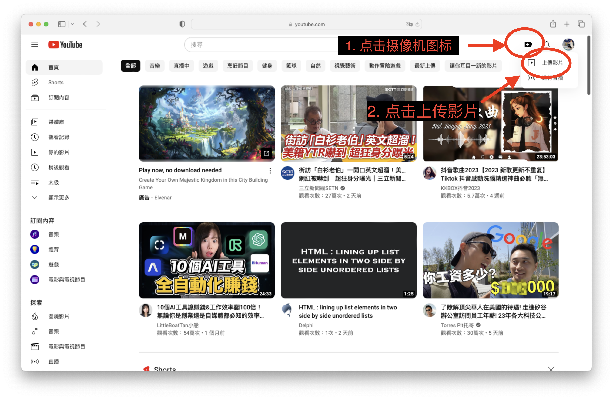

3. 确保您已经将影片从百度网盘上下载到电脑中。接着，点击```「选取档案」```。
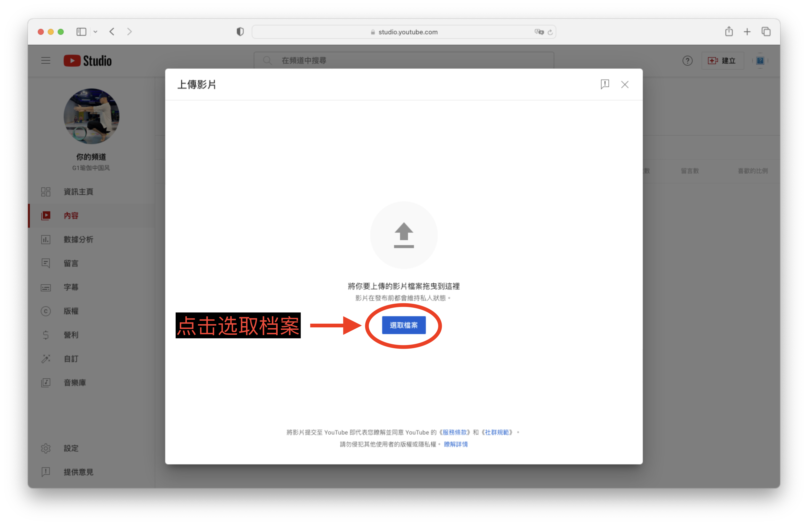

4. 在```"Downloads"```文件夹中找到您刚刚下载的文件（一般以```.mov```或者```.mp4```作为文件名的结尾），并提交
   
5. 根据下图，填写视频标题、视频简介（以中文填写）。接着，可以选择系统在视频中截取的图片作为视频的缩图（右边三张），或者自己上传自己制作的缩图（最左边的按钮）。填写说明可以使用网站上[免费的ChatGPT服务](https://github.com/LiLittleCat/awesome-free-chatgpt)，注意不要在这些网站上输入自己的个人信息。
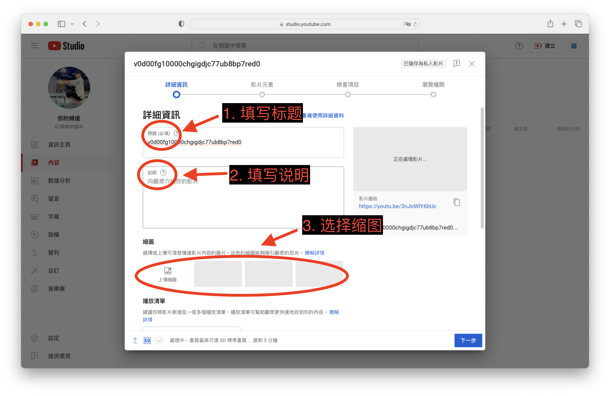

6. 往下滑。根据下图，在```播放列表```下面，点击```选取```，然后选择属于该视频的播放清单，例如```瑜伽```或者```太极```，也可以创建自己的播放清单。接着，点击```显示更多```，接着在上面点击「否，这不是儿童专属的影片」。
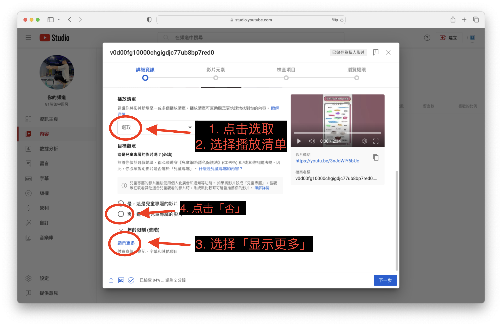

7. 往下滑。根据下图，在```标记```下面，输入属于这个视频的标签，用逗号来隔开不同的标签。这些标签可以让其他人更快地找到你的视频。然后点击「下一步」。
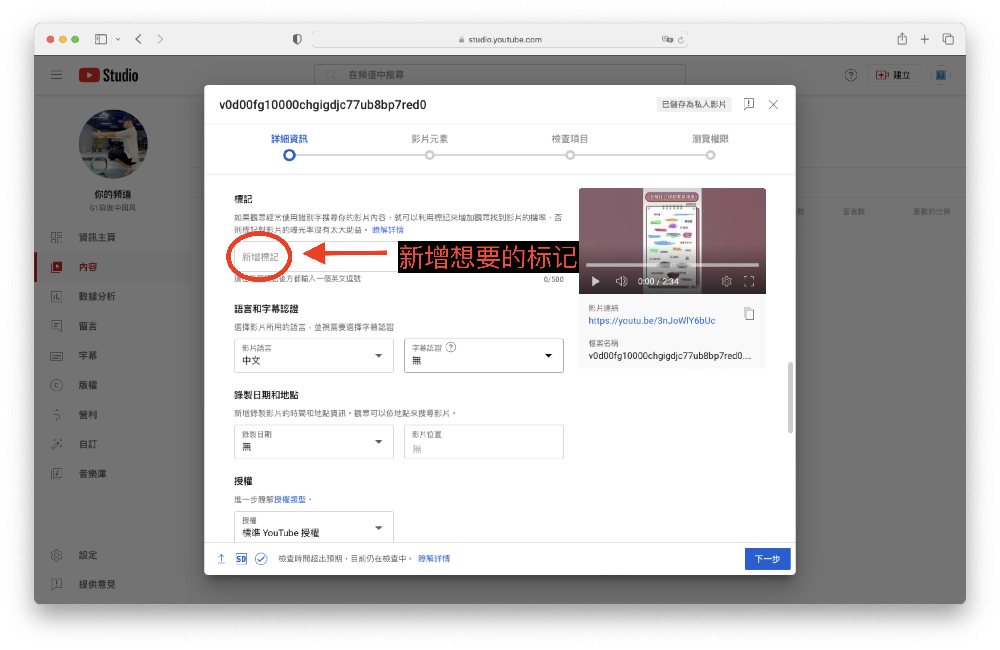

8. 点击「下一步」。

9. 如果视频里使用了其他的音乐，系统会自动识别并增加这些音乐的版权信息。检查相关的版权信息无误，然后点击```下一步```。
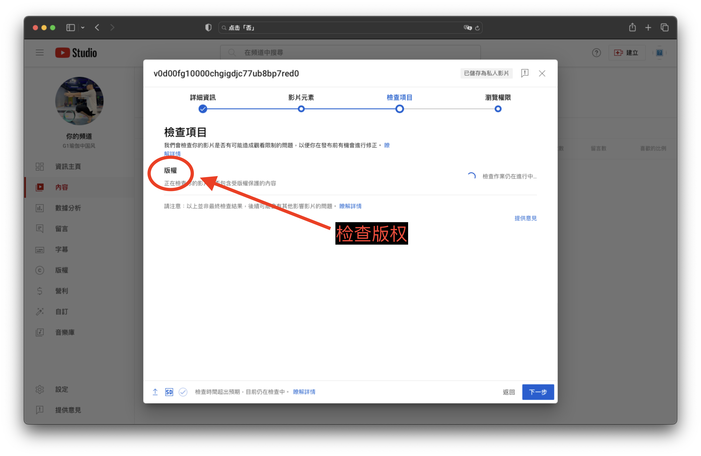

10. 点击「公开」，这样可以立刻公开你上传的视频。然后点击```储存```。
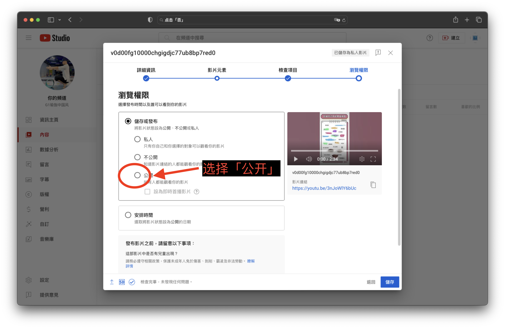

11. Voila! 将鼠标放到上传好的视频中，点击图标，就可以看到已经上传的视频了！
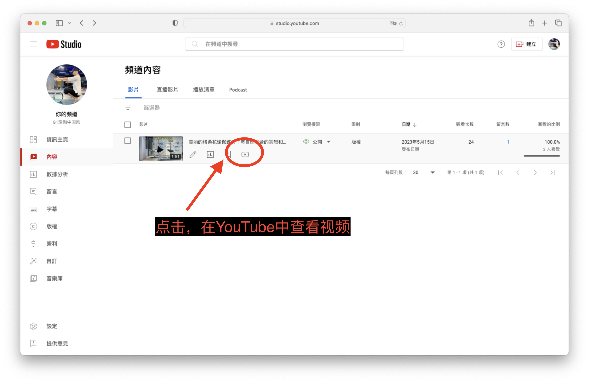

## 如何加英文的标题和简介

1. 打开Youtube页面，确保登录了正确的帐号。
   
2. 如下图，点击头像，点击```YouTube工作室```。
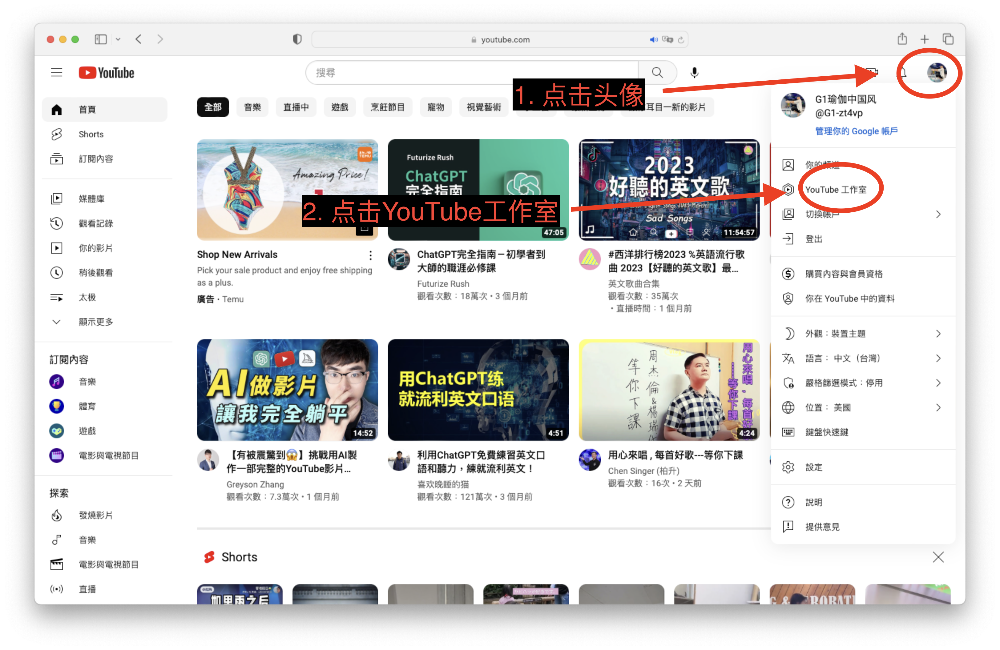

3. 如下图，点击```字幕```，选择想要添加英文标题的影片。
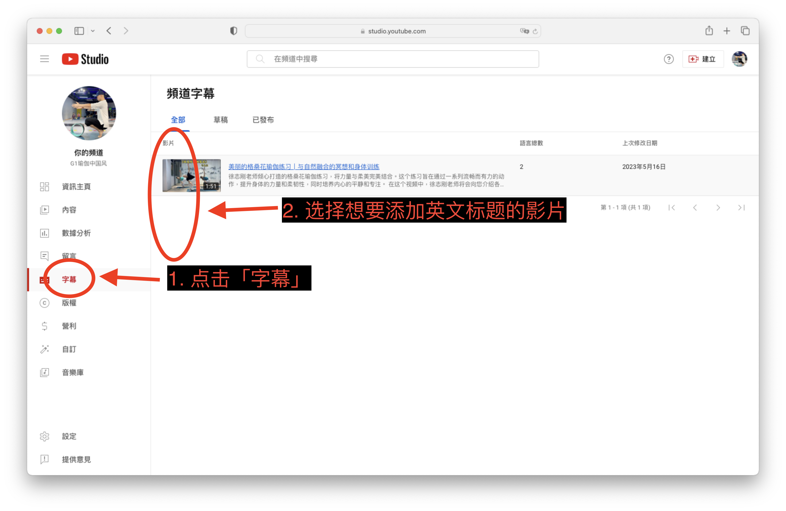

4. 如下图，点击```新增语言```，选择英文。
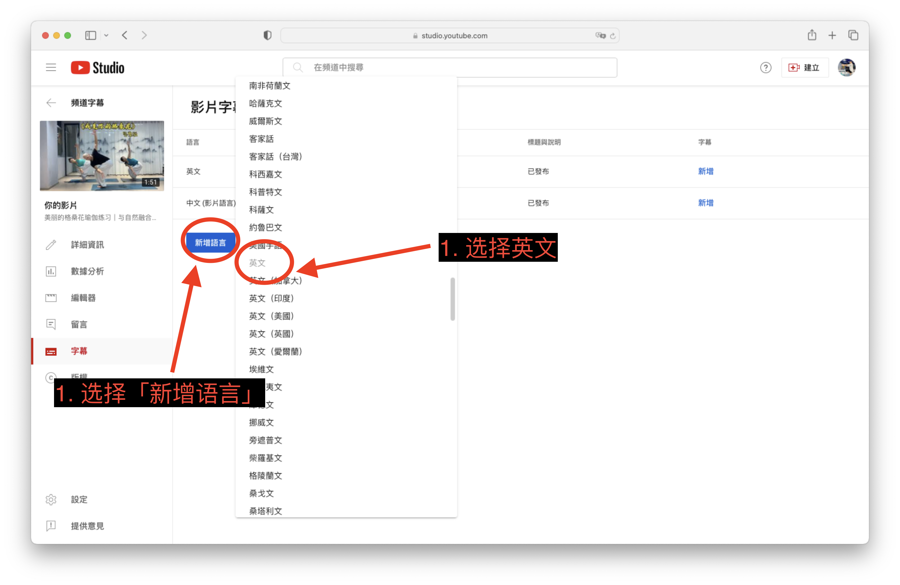

5. 如下图，填写标题和说明，点击```发布```即可。
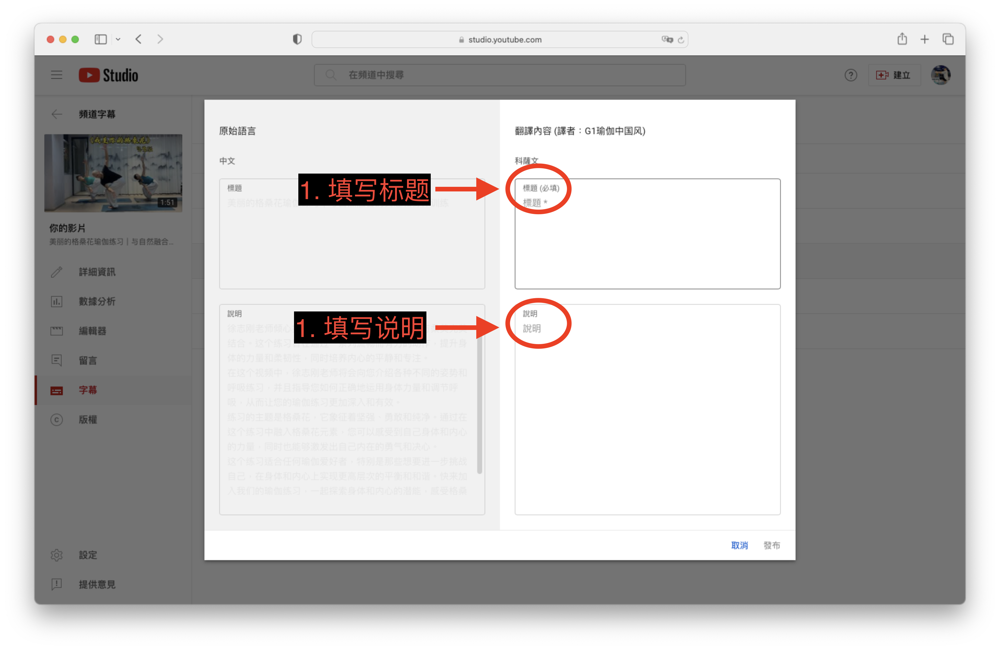